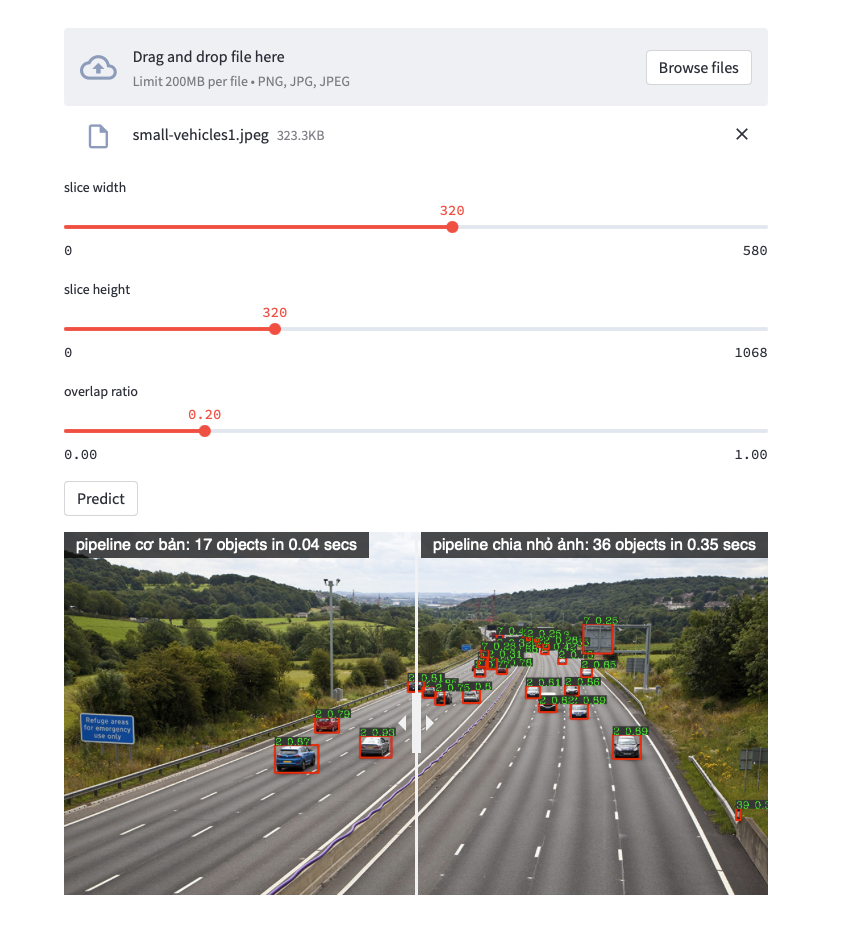
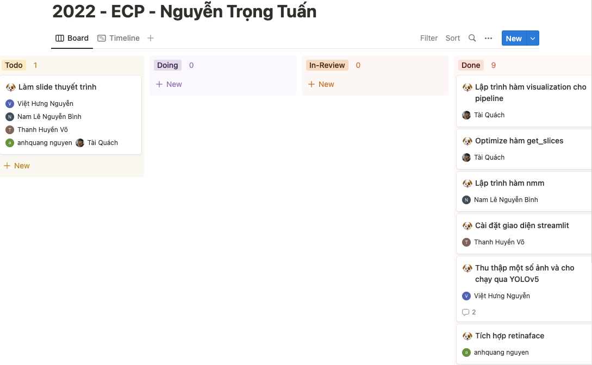
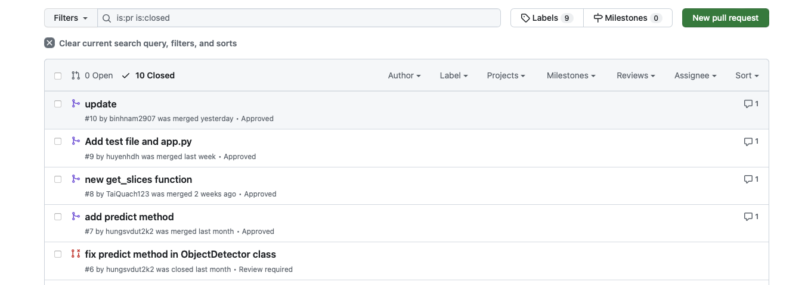

<h1 align="center"><b>Small Object Detection</b></h1>
<h3 align="center"><b>AIVN - End Course Project - AIO2022</b></h3>

----

This is an AIO2022's end course project that aim to solve problems in detecting small objects in images.

In this project, we enhanced the traditional preprocessing and postprocessing method of object detection to enable any object detection models to have better performance in detecting small object without wasting computational resource and time in retraining the model.

## **Usage**
First, you have to install all python dependencies that are specified in the [requirements.txt](requirements.txt) file by `pip install -r requirements.txt`

Then, you can easily run the streamlit app by `streamlit run app.py`

    

## **Contribution**
Instead of only focusing on implementing the proposed method, we also employed many tools that help us to manage the project and collaborate with the team better.

We used a Kanban board to visualize daily task and keep track of our project. Tasks will be specified by the leader of the team and then assigned to team's members. Each task has it own checklist to ensure that assignees would not miss anything. At the final, the leader will review all the work again and maybe pull a change request if needed. Thanks to Notion, we had an amazing Kanban Board!

    

Last but not least, we also used Github to manage the code. Each member need to fork this repo to their own Github account and need to make change on your forked repo first. Whenever they complete a feature, they will create a pull request on this repo and the leader will review and merge the code.

    

### **Contributors**

